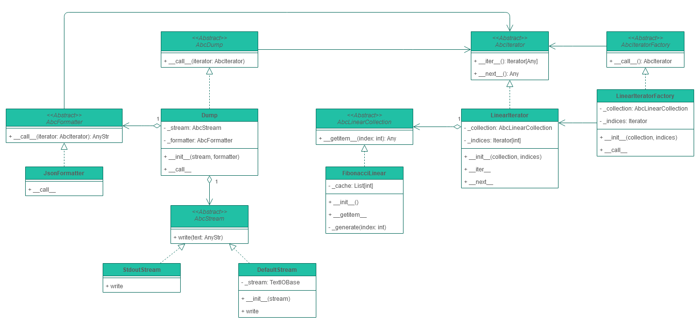

# Initialization
## Clone project
```bash
git clone https://github.com/yari61/otus-patterns-iterator.git
cd otus-patterns-iterator
```

## Virtual environment
It is recommended to create a virtual environment at first (.venv for example)
```bash
python -m venv .venv
```

Then activate it with
- ```source .venv/bin/activate```
on Unix-like systems, or
- ```.venv\Scripts\activate```
if Your system runs Windows

## Installation
To install the package run the next command in your virtual environment
```bash
pip install -e .
```

## Testing
To run tests execute the command listed below
```bash
python -m unittest
```

# Project description
## Class diagram


# Quick start guide
## Command line interface
```bash
# to stdout
python -m fibonacci --start <start_index> --stop <final_index> --step <step>
# to file
python -m fibonacci --start <start_index> --stop <final_index> --step <step> -o </path/to/file>
```